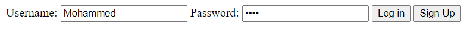

---

# ER Diagram


---
# How To Run the Website

1. Clone the following [repository](https://github.com/Dawood0/Simple_Social_Network).
   ```
   git clone https://github.com/Dawood0/Simple_Social_Network
   ```
2. Configure MySQL credentials to match the host settings.
📦Simple_Social_Network
 ┣ 📦databases
 ┃ ┣ 📜db.js
3. Run the schema file to create an instace of the database used in website.
   📦Simple_Social_Network
 ┗ 📜database.sql
4. Run the website
 ```
 node index.js
 ```
5. Access localhost port 8000 from your browser.
 ```
 localhost:8000
 ```

# Test Cases

### Sign up



### Hashing the user's password


### Login


### Wrong Credentials Login


### Logout


### User Does Not Exist

