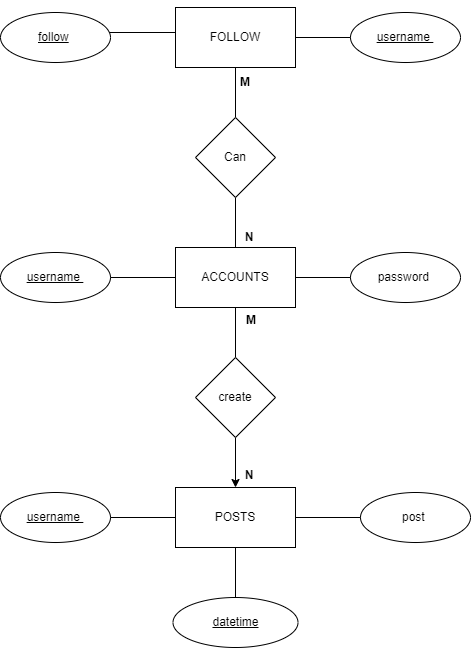
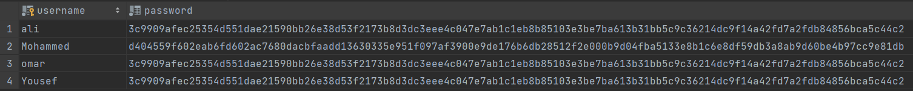
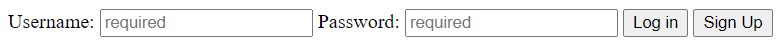
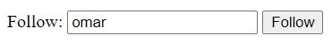
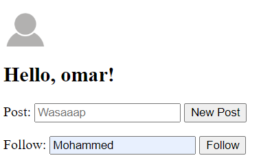
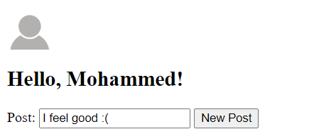
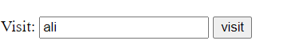
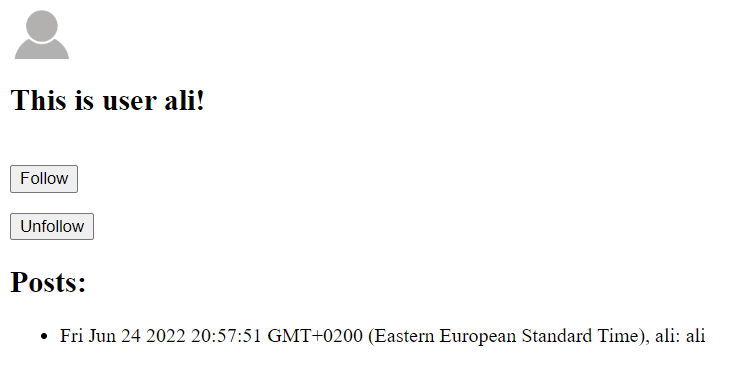

---

# ER Diagram


\

---

# How To Run the Website

1. Clone the following [repository](https://github.com/Dawood0/Simple_Social_Network).
   ```
   git clone https://github.com/Dawood0/Simple_Social_Network
   ```
2. Configure MySQL credentials to match the host settings.
    ```
    Simple_Social_Network
    |- databases
    | |- db.js
    ```
3. Run the schema file to create an instace of the database used in website.
    ``` 
    Simple_Social_Network
    |- database.sql
    ```

4. Run the website
    ```
    node index.js
    ```
5. Access localhost port 8000 from your browser.
    ```
    localhost:8000
    ```

# Test Cases

### Sign up


\

### Hashing the user's password



\

### Login


\

### Wrong Credentials Login


\


\


### Logout




### Friends

To be friends with someone you have to mutually follow each other.


\



\


\



\


\


### Creating new post



\


\


### Profile page


\

### Search


\


\

### Visit



\



\

### Follow an Already Followed User


\


\

---